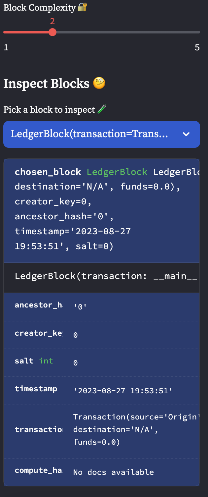

# StreamChain Ledger: The Digital Evolution of Decentralized Transactions! 🌐💼

Greetings, digital navigators! The decentralized finance horizon is expanding, and as pathfinders, we're steering the ship into uncharted waters. Using a refined Python script, we're architecting a next-gen, blockchain-backed ledger. This isn't just any ledger – it's a testament to innovation and a beacon of financial transparency.

## Our Expedition 🚀

Navigating the digital realm involves key checkpoints:

### Checkpoint 1: Designing the Transaction Schema 📜

The first step in our digital odyssey is crafting a master blueprint for the financial transactions. Enter the `Transaction` class. This isn't just data; it's the DNA of every financial interaction in our ledger.

### Checkpoint 2: Reinventing the Block Paradigm 🔗

With the `Transaction` class in our arsenal, it's time to revolutionize the `LedgerBlock` class. No more mundane data attributes; we're embracing the `transaction` attribute. It's not just about storing data; it's about capturing value.

### Checkpoint 3: Interactive Intelligence with Streamlit Dashboard 🖥️

In the digital age, interaction is king. Our Streamlit dashboard isn't just a user interface; it's a digital command center. From here, we can log, track, and validate every transaction on our StreamChain ledger.

### Checkpoint 4: Unleashing the Power of StreamChain 💣

Time to put StreamChain under the microscope. We're going live, logging transactions, mining blocks, and putting our blockchain validation to the ultimate stress test.

## Our Digital Toolkit 🔧

To conquer the digital frontier, we're leveraging a suite of Python libraries:

1. `streamlit`: Crafting our digital command center.
2. `dataclasses`: Blueprinting our `Transaction` and `LedgerBlock`.
3. `typing`: Precision in our data structures.
4. `datetime`: Stamping time in the digital realm.
5. `pandas`: Maneuvering data like a maestro.
6. `hashlib`: Ensuring cryptographic perfection.

## Decoding the Scroll 🗝️

Our mission involves refining a given script. This isn't just code; it's art:

1. Sculpting the `Transaction` class with the power of `@dataclass`. Attributes: `source`, `destination`, and `funds`.
2. Revamping the `LedgerBlock` class. Goodbye `data`, hello `transaction`.
3. Enhancing Streamlit for interactive transaction logging.
4. Validating our StreamChain, a process that involves block creation and blockchain validation.

## The Vision 🎯

As we dock at the end of our expedition, we'll possess a blockchain-backed ledger that's not just functional but revolutionary. And as a testament to our journey, we'll capture the essence of StreamChain through snapshots of its operational prowess.

Buckle up, navigators! It's not just coding; it's pioneering! 🌐🔍

---
---
---

## Digital Snapshots 📸

Immerse yourself in the digital marvel that is our StreamChain Ledger application.

### The Streamlit Command Center

At the heart of our application lies the Streamlit dashboard. It's not just an interface; it's the nexus of interaction. From logging transactions to celebrating block additions with balloons, this is where the magic happens.

### Delving Deep with Block Inspector 🔎

Transparency is the name of the game. With the Block Inspector, every transaction is an open book. Dive deep, validate, and trust the process.

### Chain Authenticity in Action

Validation isn't just a process; it's a commitment to integrity. With a single click, authenticate every link in the chain. It's not just about trust; it's about setting the gold standard.
